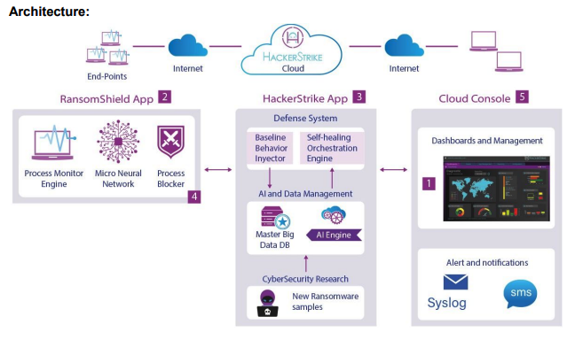

# Orchestrator Definition
Ralph sent an email with [Orchestrator Definition](https://docs.google.com/document/d/1QZtYFcDpkfOKJbFhkw-XPuD1eix0ovXSOe3cyEQivQQ/edit) attached.  The link is the  google doc attached in the email.

The question being asked was:

How does RansomShield define “network” to select which devices should be self-healed?

1. One feature of Ransom Shield is the “Self-Healing’ feature. This feature will train the local agent(app) on known malware to other devices on the network
2. Define what end-points will “react” or change status or blocking activities if one end-point is infected by ransomware. This is for the self-healing feature.
3. How will the solution decide which end points should be classified as “connected” to the infected end-point.

My summary of the question:

What is the User interface mechanisim Hacker Strike should implement to regulate RansonShield App Process Blocker within an associated user group.

So, as I look at this, I think the answer is:

Use the Baseline Behavior Injector, where the user's 'acceptable' behavior is captured.  In my head this is where all expectations should be exercised, resources and interconnects mapped.

Your solutions lead me to think I don't know what the question is.

1. "Network" should be defined via the "Baseline Behavior".
2. "Shield" is blocking access to a resource. 
3. "Self-Healing" ?  Wouldn't that be Baseline Behaviour Modification ?

.... well I think I'm lost

Notes:
The new diagram with numbered lables.

1. Dashboards and Management
2. RansomShield App
3. HackerStrike App
4. Process Blocker or all three parts of #2 RansomShield App
   1. Process Monitor
   2. Micro Neural Network
   3. Process Blocker
5. Cloud Console

I do not know the intention of the numbering.  As for myself, I sorted my mental map of the dataflow a few months ago [See docs/README.md](./README.md) :

1. hs-client - used to collect telemetry and execute behavior mitagation
2. hs-telemetry - api based web service target used by client for telemetry collection
3. hs-mllab - lab for machine learning pipline used for the creation of client mitagation neural patterns
4. hs-malwarelab - lab used to create malware use telemetry for hs-mllab
5. hs-dsllab - lab used to model Domain Specific Language useage patterns to obtain deeper business specific use patterns
6. hs-customer-webportal - gui portal for ralph-types to show client value
7. hs-automation-webportal - gui portal for ralph-types... IMHO this should just be a deployment CI/CD pipeline

