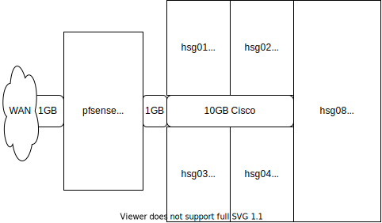

[Back to docs Index](../)

# hs grid overview
Overview of components and innterconnect for an IaS grid deployment.

## Components

Note: hsgrid-overview [Edit via draw.io]()

1. POE Node - WAN Point of Entry 
  - Router [pfsense](https://www.pfsense.org/)
  - Firewall [pfsense](https://www.pfsense.org/)
  - Switch [pfsense](https://www.pfsense.org/) or [cumulus](https://cumulusnetworks.com/products/cumulus-linux/)
2. LAN SDN - Local Area Network (LAN) Software Defined Network (SDN)
  - DHCP [drp](http://rebar.digital/)
  - iPXE [drp](http://rebar.digital/)
  - DNS [drp](http://rebar.digital/)
  - Subnets
  - VLAN
3. CPU SDC - Central Processing Unit (CPU) Software Defined Compute (SDN) 
  - Bare Metal Boot iPXE [drp](http://rebar.digital/)
  - Virtual Machines [XenServer](https://www.citrix.com/downloads/citrix-hypervisor/)
  - K8s [k8s](https://kubernetes.io/)
4. Storage SDS - Software Defined Storage (SDS)
  - local [drp](http://rebar.digital/)
  - iSCSI [drp](http://rebar.digital/) [freeNAS](https://www.freenas.org/)
  - NFS [freeNAS](https://www.freenas.org/)
  
  
